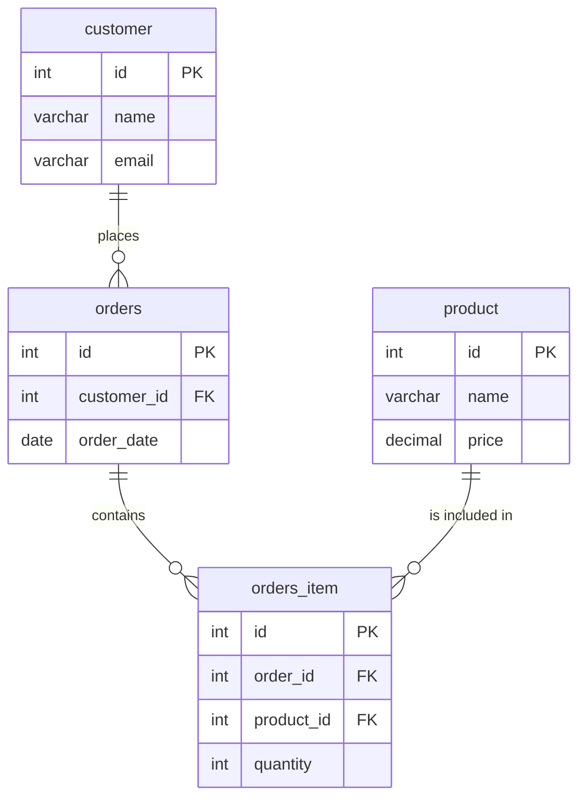

```mermaid
erDiagram
    customer {
        int id PK
        varchar name
        varchar email
    }

    product {
        int id PK
        varchar name
        decimal price
    }

    orders {
        int id PK
        int customer_id FK
        date order_date
    }

    orders_item {
        int id PK
        int order_id FK
        int product_id FK
        int quantity
    }

    customer ||--o{ orders : "places"
    orders ||--o{ orders_item : "contains"
    product ||--o{ orders_item : "is included in"
```
